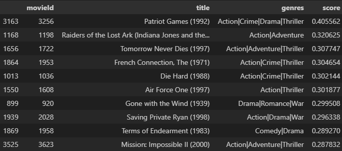
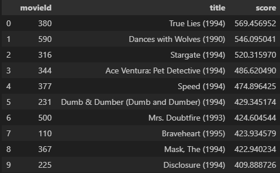
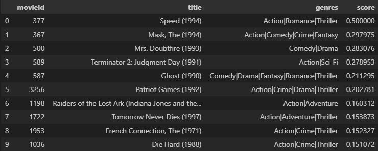

# 🎬 Hybrid Movie Recommendation System  

This project is a **hybrid movie recommender system** that combines **Content-Based Filtering (CBF)** and **Item-Item Collaborative Filtering (CF)**.  
It was developed as part of the course *"Introduction to Artificial Intelligence"* at Warsaw University of Technology (WUT).  

## 📌 Project Description
The system generates movie recommendations using two approaches:  
1. **Content-Based Filtering (CBF)** – recommends movies based on similarity of metadata (e.g. genre, description).  
2. **Collaborative Filtering (CF, item-item)** – recommends movies based on user behavior and item similarity.  

The hybrid model works as follows:
- Generate a recommendation vector from CBF and from CF.  
- Normalize both vectors to the range **[0, 1]**.  
- Combine them using a weighted formula:  

```python
hybrid['score'] = alpha * hybrid['score_cf'] + (1 - alpha) * hybrid['score_cbf']
````

* The system returns the top **X recommended movies** for a user.

Dataset used: **MovieLens 32M**

## ⚙️ Technologies

* Python
* Pandas
* NumPy
* SciPy
* scikit-learn
* Implicit
* Matplotlib
* Jupyter Notebook

## 🚀 Installation & Usage

### 1. Download dataset

Download the **MovieLens 32M dataset** from [https://grouplens.org/datasets/movielens/32m/](https://grouplens.org/datasets/movielens/32m/).
Unzip the dataset into the `data/` folder so that all `.csv` files are directly available inside:

```
movie_recommender/
│── data/
│   ├── movies.csv
│   ├── ratings.csv
│   └── ...
```

### 2. Install dependencies

We recommend creating a virtual environment. Install the required libraries with:

```bash
pip install -r requirements.txt
```

### 3. Run notebooks

* Run the **hybrid notebook** to see the full recommender in action.
* Alternatively, run **content_based.ipynb** or **collaborative.ipynb** separately to test each method independently.

## 📊 Results

Currently, no advanced evaluation metrics (precision, recall, RMSE) are included, as initial results were weak.
However, we provide **example recommendation outputs and screenshots** to demonstrate the system’s behavior. Recommendations were made for user with ID = 5.
<br><br>**CBF Output**<br>

<br><br>**CF Output**<br>

<br><br>**Hybrid Output**<br>



## 📂 Repository Structure

```
project-root/
│── data/           # Dataset (not included, must be downloaded manually)
│── notebooks/      # Jupyter notebooks (content_based, collaborative, hybrid)
│── src/            # Utility scripts (e.g., word cleaner)
│── report/         # Reports (in Polish, PDF + LaTeX sources)
│   └── preparations_report/
│   └── final_report/
│         └── pictures/   # Figures used in report
│── images/         # Images used in README.md
│── README.md
│── requirements.txt
```


## 👥 Authors

* [Piotr Iśtok](https://github.com/p10tr13)
* [Piotr Jacak](https://github.com/piotrjacak)

Project developed at **Warsaw University of Technology** (*WUT*) for the course *Introduction to Artificial Intelligence* (2024/25).


## 📄 License

This project is licensed under the [MIT License](LICENSE).
